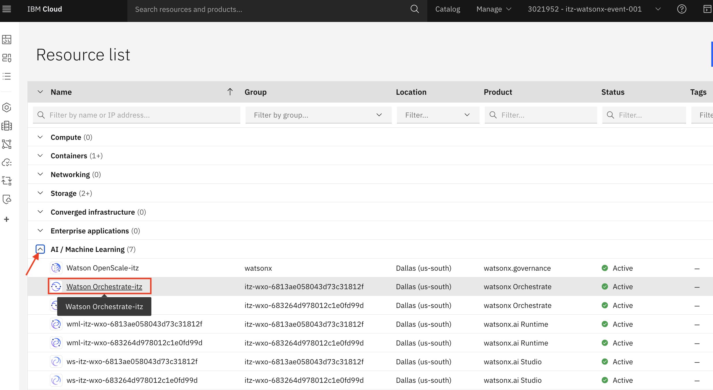
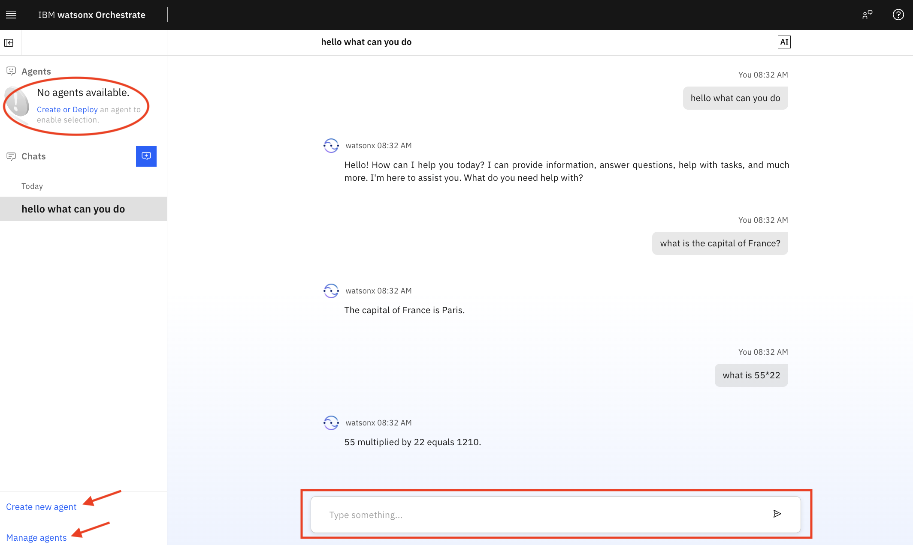
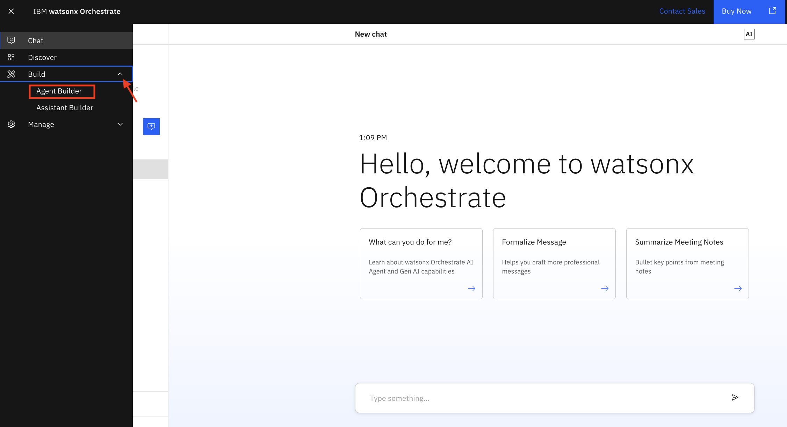
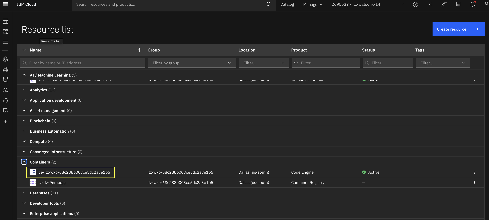
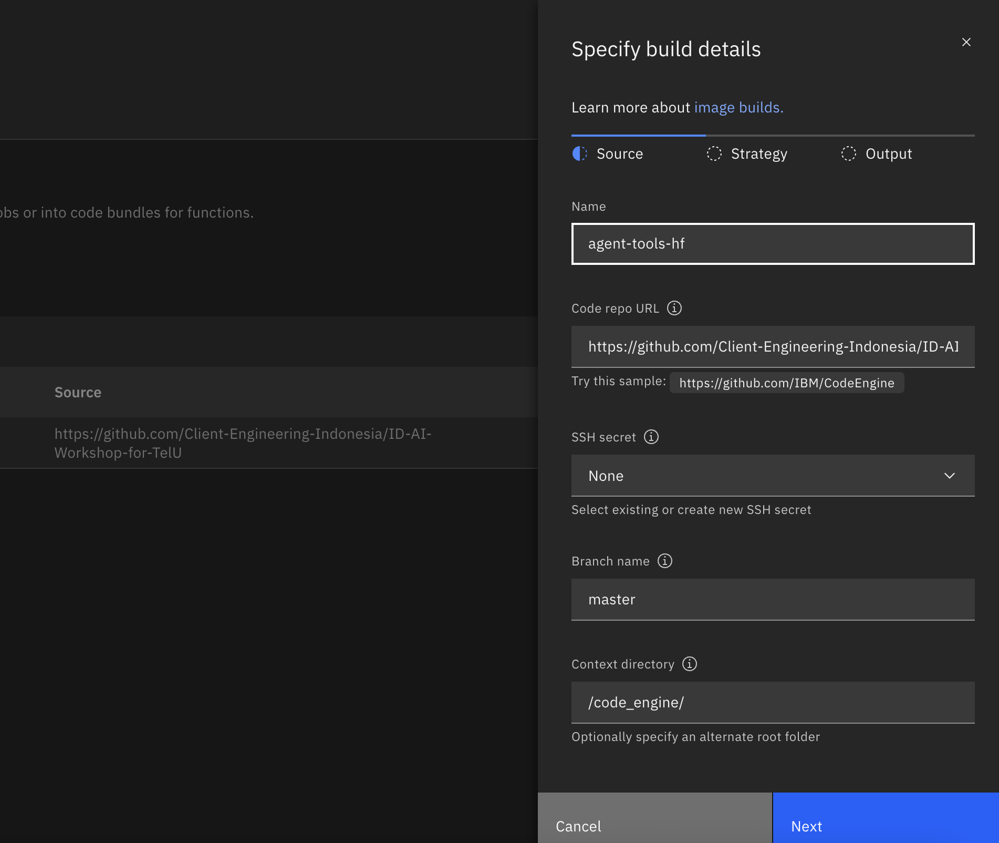
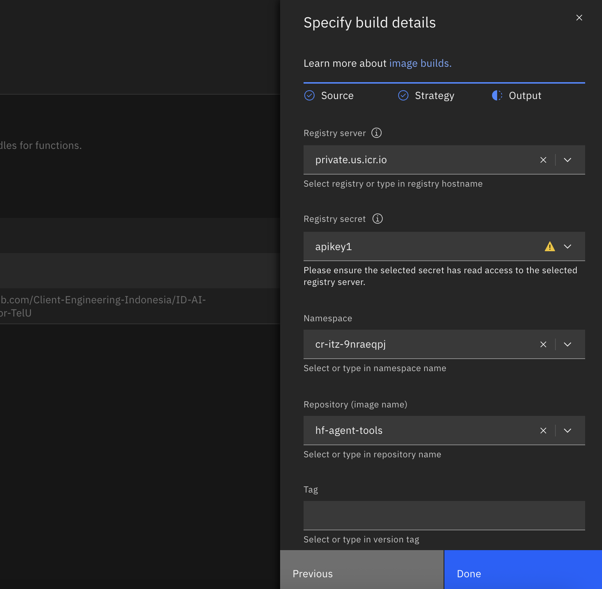

# 👨🏻‍💻 Use case: Financial Analyst Agent  

## Table of Contents
- [Use Case Description](#use-case-description)
- [Architecture](#architecture)
- [Pre-requisites](#pre-requisites)
- [Accessing watsonx Orchestrate](#accessing-watsonx-orchestrate)
- [Financial Analyst Agent Creation](#financial-analyst-agent-creation)
  - [Agent Configuration with Knowledge Base](#agent-configuration-with-knowledge-base)
- [Prepare Custom Tools](#prepare-custom-tools)
  - [Accessing IBM Code Engine](#accessing-ibm-code-engine)
  - [Build Docker Image](#build-a-new-docker-image)
  - [Run the Application](#create-an-application-from-the-image)

## Use Case Description

Merdeka Financial plans to implement an AI-powered Financial Research Agent to support their team of financial research analysts in accelerating their research and producing high value investment opportunities. The goal is to create an AI-powered agentic solutions that supports financial research analysts in executing the following tasks:

* Parse financial reports and extract key information.
* Provide comparative analysis between different entities based on their financial reports.

By automating these tasks, the company aims to accelerate research process to identify new opportunities for investment.

## 🏛 Architecture  <a id="architecture"></a>

In this lab, we will build an agent that can store earning reports and use these to answer questions from financial analysts.

## Accessing watsonx Orchestrate
To access watsonx Orchestrate, follow these steps:

1. If not already logged into your IBM Cloud account, navigate your preferred browser to https://cloud.ibm.com and log in with your credentials (which you used for your TechZone reservation).

2. On your IBM Cloud landing page, click the top left navigation menu (hamburger menu) and select **Resource list** (annotated with red rectangle).
*Note: If you are a member of multiple IBM Cloud accounts, make sure you are working in the correct account (annotated with red oval) which has the required services available as explained in the [environment-setup](https://github.ibm.com/skol/agentic-ai-client-bootcamp/tree/staging/environment-setup) guide.*
 

3. On the Resource List page, expand the **AI / Machine Learning** section (annotated with red arrow), and click the **Watsonx Orchestrate** service (annotated with red rectangle) service name.
 

4. Click **Launch watsonx Orchestrate** (annotated with red arrow) to launch the service.
 

5. Once watsonx Orchestrate service is launched, you would be at its landing page as illustrated in the figure below. You will see an intuitive conversational interface with a chat field (annotated with red rectangle) where you can type any text to start interacting with watsonx Orchestrate. When you start with a new service instance, there will be no custom agents defined and thus, the section under **Agents** will state *No agents available*. You can either click **Create or Deploy** an agent under the Agents section or you can click **Create new agent** (annotated with red arrow) to start developing new agents. You can also select the **Manage agents** link to navigate to the agent management page.
Try to type a few generic questions and observe the responses from the large language model (LLM) powering the prebuilt agent in watsonx Orchestrate which ensures basic functionality until custom agents are created.
 


## Financial Analyst Agent Creation
In this section, you will go through the process of creating an AI agent in watsonx Orchestrate:

6. To start building agents, you can click the **Create new agent** link as referenced in step 5 or alternatively, click the top left navigation menu, expand the **Build** section (annotated with red arrow) and select **Agent Builder** (annotated with red rectangle). This will redirect you to the Manage agents page.
 

7. The Manage agents page will initially be blank since no agents have been created yet. As you create more and more AI agents that can reason and act, the Manage agents page will be populated with those agents. Note the analytics captured at the top of the page including **Total messages**, **Failed messages**, and **Latency average** (annonated with red rectangle). Also, note the **Discover** button (annonated with red oval) which you can click to explore and discover the [catalog of pre-built agents and tools in watsonx Orchestrate](https://www.ibm.com/docs/en/watsonx/watson-orchestrate/base?topic=discovering-catalog). Click **Create agent** button (annotated with red arrow) to start building your first agent.
 

8. On the Create an agent page, select **Create from scratch** tile (annotated with red rectangle), provide a **Name** and a **Description** for the agent and click **Create** (annotated with red arrow).

Name: 
```
Financial Analyst Agent
```
Description: 
```
Agent skilled at financial research using internal knowledge and external search of public information.
```
The natural language description of an agent is important as it is leveraged by the agentic solution to route user messages to the right agent skilled in addressing the request. For more details, please review the [Understanding the description attribute for AI Agent](https://www.ibm.com/docs/en/watsonx/watson-orchestrate/current?topic=agents-creating#understanding-the-description-attribute-for-ai-agent) documentation.

watsonx Orchestrate supports creating an agent from scratch or from a template which involves browsing a catalog of existing agents and using attributes of another agent as a template for the new agent. For this lab, you will be creating agents from scratch.
 


### Agent Configuration with Knowledge Base
After the AI Agent is created, in this section, you will go through the process of configuring the agent with knowledge and tools to enable it to respond to queries using information from the knowledge base and perform tasks using the tools.

9- Next, you will go through the process of configuring your agent. The Financial Analyst Agent page is split in two halves. The right half is a **Preview** (annotated with red oval) chat interface that allows you to test the behavior of your agent. The left half of the page consits of five key sections (annotated with red rectangle) that you can use to configure your agent.

   - Profile: The **Profile** section consists of the description of the agent which you provided as part of creating the agent. You can always go to this section to edit and refine the description of the agent as needed. In this section, you also specify the **Agent style** whether *Default* or *ReAct*. 
   
   *Note: For more details, Please consult the [Choosing a reasoning style for your agent](https://www.ibm.com/docs/en/watsonx/watson-orchestrate/base?topic=agents-choosing-reasoning-style-your-agent) documentation to understand the difference and how it affects the agent's behavior.*

   - Knowledge: The **Knowledge** section is where you can add knowledge to the agent. Adding knowledge to agents plays a crucial role in enhancing their conversational capabilities by providing them with the necessary information to generate accurate and contextually relevant responses for specific use cases. You can directly upload files to the agent, or connect to a Milvus or Elasticsearch instance as a content repository. Through this **Knowledge** interface, you can enable your AI agents to implement the Retrieval Augmented Generation (RAG) pattern which is a very popular AI pattern for grounding responses to a trusted source of data such as enterprise knowledge base.
   
   *Note: For more details, please consult the [Adding knowledge to agents](https://www.ibm.com/docs/en/watsonx/watson-orchestrate/current?topic=agents-adding-knowledge) documentation.*

   - Toolset: While *Knowledge* is how you empower agents with a trusted knowledge base, then **Toolset** is how you enable agents to take action by providing them with *Tools* and *Agents*. Agents can accomplish tasks by using **Tools** or can delegate tasks to other **Agents** which are deeply skilled in such tasks.

   *Note: For more details, please consult the [Adding tools to an agent](https://www.ibm.com/docs/en/watsonx/watson-orchestrate/current?topic=agents-adding-tools) and [Adding agents for orchestration](https://www.ibm.com/docs/en/watsonx/watson-orchestrate/current?topic=agents-adding-orchestration) sections of the documentation.*
   
   - Behavior: The **Behavior** section of the agent configuration is where you provide instructions to the agent to define how it responds to user requests and situations. You can configure rules that dictate when and how the agent should take action. These rules help the agent behave in a predictable and consistent manner, delivering a seamless user experience.

   *Note: For more details, please consult the [Adding instructions to agents](https://www.ibm.com/docs/en/watsonx/watson-orchestrate/current?topic=agents-adding-instructions) documentation.

   - Channels: The **Channels** section is how you expose your agent to different communication platforms (for example, Slack). This integration improves user experience and agent accessibility. At ths time of this lab writing, channel support is in *Preview* with support for *WebChat*, *Microsoft Teams*, and *WhatsApp with Twilio*. The product will be adding support for additional channels where you can deploy your agent(s).

   *Note: For more details, please consult the [Connecting to channels](https://www.ibm.com/docs/en/watsonx/watson-orchestrate/base?topic=agents-connecting-channels) documentation.

Lastly, after you've completed your agent configuration and tested its performance, you can **Deploy** the agent (annotated with red arrow) to make it available through the selected channel. 

 

10- On the agent configuration page, review the *Description* of the agent in the **Profile** section and keep as is (no edits necessary). Also, keep the *Agent style* selection as **Default**. Next, scroll down to the **Knowledge** section, or click the **Knowledge** shortcut (annotated with red oval). In the Knowledge section, add a description to inform the agent about the content of the knowledge. For this lab, add the following description as we will provide the agent with a number of recent earnings reports for a handful of companies.

Description: 
```
This knowledge addresses all details about earning reports for the companies of interest. Research analysts can ask about any details from earning reports.
```

Next, you have to choose how to provide knowledge information to the agent. watsonx Orchestrate supports adding knowledge to the agent either by uploading files directly through the UI or by pointing to a content repository (Mivlus or ElasticSearch). The [Adding knowledge to agents](https://www.ibm.com/docs/en/watsonx/watson-orchestrate/current?topic=agents-adding-knowledge) documentation provides more details. For this lab, click the **Upload files** button (annotated with red arrow) to upload pdf files capturing earnings reports for AMZN, META, NVDA, and NFLX.

 


Drag and drop the following pdf files to upload to the knowledge for the agent :
   - [AMZN-Q4-2024-Earnings.pdf](assets/AMZN-Q4-2024-Earnings.pdf)
   - [META-Q4-2024-Earnings.pdf](assets/META-Q4-2024-Earnings.pdf)
   - [NFLX-Q4-2024-Earnings.pdf](assets/NFLX-Q4-2024-Earnings.pdf)
   - [NVDA-Q4-2024-Earnings.pdf](assets/NVDA-Q4-2024-Earnings.pdf)

 


11- Once the files are all uploaded to the knowledge base, you can start testing the agent to validate how it can respond to questions using this knowledge base. The uploaded files get processed and prepared to be leveraged by the agent. After the upload completes, test the agent by asking a few questions such as:

```
Can you tell me about Meta's business
```

You should see the responses being retrieved from the uploaded documents and then the final response generated by the agent as illustrated in the figure below. Click *Show Reasoning* (annotated with red oval) and also *Step 1* to review the agent's reasoning and validate it is correctly retrieving the answer from the knowledge base. Additionally, click the *Toggle Citation* icon (annotated with red arrow) to show the actual document from which the response is retrieved. Note it is correctly getting the response the Meta's earnings report (annotated with red rectangle).

 

Try another test as follows:

```
I'm interested in learning more about Meta and Amazon. Can you tell me a bit about their businesses?
```
Observe the response being generated using the knowledge base. As before, click the *Toggle Citation* icon (annotated with red arrow) to show the refernced documents. Click *Next* icon (annonated with red oval) to review all retrieved documents.

 

Feel free to try a test like ```Give Toyota q4 financial results``` and review the response from the agent which should indicate that it has no information about Toyota as shown in the figure below.

 

At this time, it is worthwhile taking a moment to reflect on what you've developed so far. You have designed an agent and empowered it with a knowledge base to enable it to respond to queries in context using its knowledge base. *Congratulations!!*

Reviewing the architecture, you've completed the part of the agentic solution which involved creating the Financial Analyst agent and empowering it with a knowledge base (annotated with red rectangles in the figure below). In the next section, you will work through the process of creating the **Financial API Agent** and the **Web Search Agent** which you will then add as collaborator agents to the **Financial Analyst Agent**.

 

## Prepare Custom Tools 
To help financial analysts perform their work more effectively, we will equip our Financial Analyst Agents with new capabilities to gather real-time data and receive news updates from the internet. To achieve this, we need to provide the agent with the necessary tools to complete its tasks. We already know there are multiple ways to add tools—by selecting prebuilt ones from watsonx Orchestrate or by creating an external agent using watsonx.ai. However, for more complex or specialized tools, we can write code in Python and deploy them as APIs. This is the approach we will take in this section.

We will prepare the following five tools:

- [get_stock_information](/code_engine/app/stock_info.py) – Receives the ticker symbol of a publicly listed company and returns the latest stock price, valuation metrics, and company fundamentals.

- [get_stock_price_data](/code_engine/app/stock_price.py) – Takes a ticker, period, and interval, and returns historical stock prices for time-series analysis.

- [get_financial_statements](/code_engine/app/financial_statements.py) – Retrieves quarterly or annual financial statements.
    - statement_type can be "income", "balance", or "cashflow".

- [search_wikipedia](/code_engine/app/wikipedia_search.py) – Retrieves definitions or background information from Wikipedia.

- [search_web](/code_engine/app/web_search.py) – Searches the web for financial news and analyst reports using DuckDuckGo.

We will deploy these functions as APIs using FastAPI and host the service on IBM Code Engine. We have already created the FastAPI application script ([main.py](/code_engine/app/main.py)) and prepared the Docker deployment script.

### Accessing IBM Code Engine
IBM Code Engine is a fully managed, serverless platform that allows you to run containerized applications, batch jobs, and microservices without managing infrastructure. It automatically handles scaling, networking, and security so you can focus on writing code instead of maintaining servers. With Code Engine, you simply package your application into a container, deploy it, and the platform takes care of running it reliably and efficiently—scaling up to handle spikes in demand and scaling down to zero when idle to save costs.

1. Open your Cloud Account via cloud.ibm.com. Go to Navigation Menu on the top left corner and open the *Resource list* page. Find an instance of Code Engine under the *Containers* category. Open the instance by clicking the name.

2. You will be redirected to the landing page of IBM Code Engine as shown below. Now, we are ready to create our own application. Click the *Image bulds* menu.


### Build a New Docker Image 
Before we can deploy an application, we have to build a docker image using scripts and dockerfile that we have prepared. Follow these steps.
1. Under the *Image builds* page, go to **Image build** tab and click **Create** button.

2. A form will appear on the right side. Fill with the following details.
Name: *choose a name for your image. For example you can name it agent-tools and give your initial*
Code repo URL: https://github.com/Client-Engineering-Indonesia/ID-AI-Workshop-for-TelU
Branch name: master
Context directory: /code_engine/
Click **Next**


3. In this part, we need to specify the dockerfile and assign the size of the machine we will require to run this Image. Use default values and just click **Next**.  


4. Next, we need to specify the registry server for storing the docker image. IBM Code Engine comes with a registry server at private.us.icr.io so let keep this value as it is. 


5. Click the drop down symbol under the *Registry secret* and click **Create registry secret** to add our apikey for accessing the registry server. 


6. The following window will open. Give a name to your secret key and enter the apikey [that we created during Lab 0](/Lab%200%20-%20Environment%20Setup/api_key_setup.md) to the given box. Click **Create**.


7. If your secret is correct, your namespace will be automatically populated. Enter **Repository** name and click **Done**


8. Check your configuration and click **Create** to start building your image.


9. Inside the **Output Image** box, you will see where the image will be stored. Click **Submit build** to start the process.


10. The form will be closed and a process is started as shown in the picture below. Click the name of the process to monitor the log. 


11. Through the following window, we can monitor the process and investigate any error that happens. Wait until the process is finished and the status changes from *Running* to *Succeeded*.


12. Go back to the previous window and you can also see the successful build listed on the page.


## Create an Application from the Image 
After we have the docker Image, we can use this image to create an application that contains all APIs we needed for improving our Financial Analyst agent.
1. Go to **Applications** menu from the sidebar on Code Engine homepage. Click **Create**.

2. The configuration window to create an application will appear. First, give a name for the application. 

3. Make sure the *Use an existing container image* is selected and click the **Configure image** button. A form will appear on the right of the window. Fill with the right details:
1- select private.us.icr.io
2- select the name of the secret you build previously
3- your namespace will appear automatically
4- select the name of your image
Click **Done**

4. You can check available configuration attributes that you can modify, such as autoscaling feature and environment variables. But we will use their default values for now. Click **Create**.

5. Wait until the deployment process is finished.

6. Once the application ready, the status will indicate it (see arrow). Go to *Domain mapping* tab and copy the public endpoint.

7. Open a new tab on your browser, copy the endpoint and add the following text right after the endpoint URL: 
/stock/info?ticker=MSFT

If information about Microsoft appears on the browser, your application is ready to be integrated to Watsonx Orchestrate.

# Let's Continue to Lab 2b