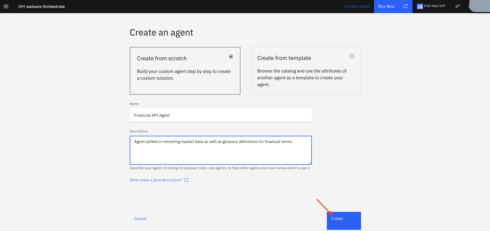
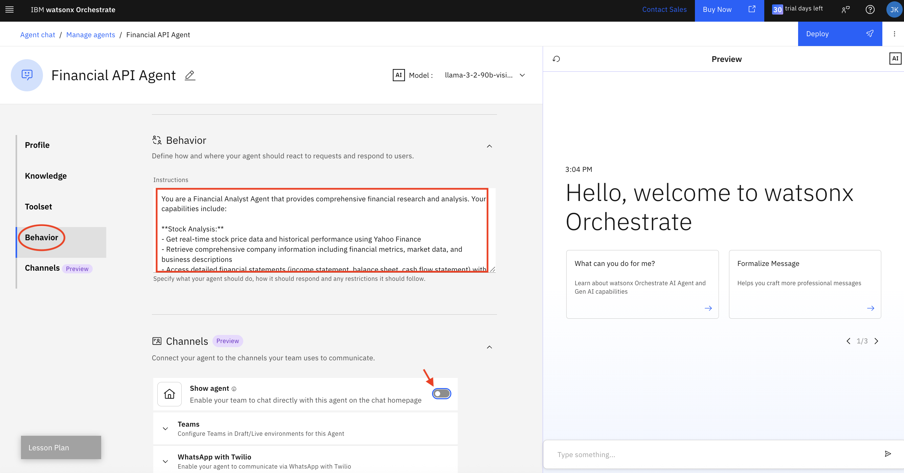
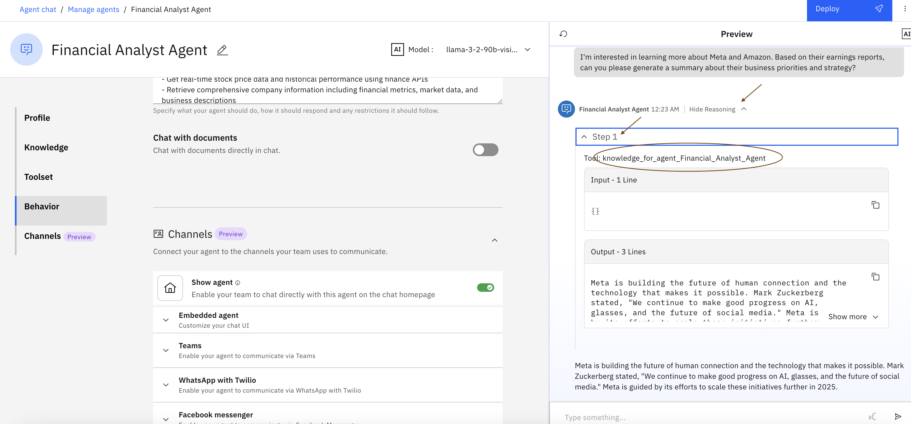

# Lab 2b - Financial Research Analyst


## Table of Contents
- [Use Case Description](#use-case-description)
- [Architecture](#architecture)
- [Financial API Agent Creation and Configuration](#financial-api-agent-creation-and-configuration)
- [Web Search Agent Creation and Configuration](#web-search-agent-creation-and-configuration)
- [Pulling it together - Complete Agent Collaboration](#pulling-it-together)
- [Experience Agents in Action using watsonx Orchestrate Chat UI](#experience-agents-in-action-using-watsonx-orchestrate-chat-ui)
- [Conclusion](#conclusion)

## Use Case Description
Merdeka Financial wants to provide its team of financial analysts with real-time financial data and the ability to search for information on the internet. They create an agent and equip it with tools to retrieve company fundamentals and analyze financial performance. The agent is also equipped with tools to look up financial terms on Wikipedia.

* Search public information for details about an entity as well as recent news and analysts reports.
* Execute internal tools for retrieving financial metrics via APIs.
* Generate a report of the findings and analysis.

By automating these tasks, the company aims to accelerate research process to identify new opportunities for investment.

## 🏛 Architecture  <a id="architecture"></a>
Here is the complete architecture that we will build.


## Financial API Agent Creation and Configuration
In this section, you will develop the Financial API Agent, one of the collaborator agents which is specifically skilled at returning market data and glossary definitions. In this hands-on lab, the Financial API Agent is empowered with two tools, the **Market Data Tool** which returns stock prices and the **Glossary Tool** which leverages Wikipedia to return glossary definitions. In practice, this agent can also get access to other internal tools such as those for modeling stock behavior or forecasting stock prices; the approach to empower the agent with such tools would be the same.

1- From the watsonx Orchestrate landing page, click **Create agent** (annotated with red rectangle) to start developing a new agent, the Financial API Agent.

 

2- On the Create an agent page, select **Create from scratch** tile , provide a **Name** and a **Description** for the agent and click **Create** (annotated with red arrow).

Name: 
```
Financial API Agent
```

Description: 
```
Agent skilled in retrieving market data as well as glossary definitions for financial terms.
```
As explained earlier, the decription of an agent is important as it is leveraged by the agentic solution to route user messages to the right agent skilled in addressing the request.

 

3- On the agent configuration page, scroll down to **Toolset** section or click the shortcut (annotated with red oval). Then cick the **Add tool** button (annotated with red arrow) to bring up the window for adding tools to the agent.

 

4- On the tool options pop-up, select **Import** (annotated with red rectangle) as illustrated in the figure below. 

 

watsonx Orchestrate supports multiple approaches to adding tools to agents as explained in the [Adding tools to an agent](https://www.ibm.com/docs/en/watsonx/watson-orchestrate/current?topic=agents-adding-tools) documentation:

   - Add from catalog: The **Add from catalog** option enables you to add a tool from a rich catalog of pre-defined tools. The catalog of tools is actively being developed to make it even easier to add tools to agents.

   - Add from local instance: The **Add from local instance** option enables you to add a tool from an existing set of tools already uploaded to the local instance of watsonx Orchestrate. 

   - Import: The **Import** option enables you to import an external tool using an OpenAPI specification and selecting which operations you want to import as tools.

   - Create a new flow: The **Create a new flow** option provides you with a drag and drop tool builder interface to create a sequence of steps that utilize conditional controls and activities. 

Additionally, you can use the watsonx Orchestrate [Agentic Development Kit (ADK)](https://developer.watson-orchestrate.ibm.com/) to develop and upload Python and OpenAPI tools to a specific watsonx Orchestrate instance which you can then add to the agents.
watsonx Orchestrate also supports the addition of [Model Context Protocol (MCP)](https://developer.watson-orchestrate.ibm.com/) tools. If you are not familiar with it, MCP is a standard for connecting AI Agents to systems where data lives including content repositories, business tools and development environments. MCP is becoming increasingly popular as the standard for enabling agents with tools.

For purposes of the Financial API Agent, you will use the **Import** option to import an OpenAPI specification and define which operations to import as tools. You will need a **financial_api_openapi.json** file which will be provided by your instructor. 

On the *Add a new tool* pop-up, select **Import from file** tile (annonated with red rectangle).

 

5- On the Import tool page, drag and drop the **financial_api_openapi.yaml** file [here](/openAPI/financial_api_openapi.yaml) and click **Next** (annotated with red arrow).


6- Next, select the checkboxes for the **Get stock information**, **Get stock price date**, **Get financial statements**, and **Search Wikipedia** operations and click **Done**.

 

7- At this point, you will see the tools imported under the Tools subsection which means they are available for the **Financial API Agent** to use these tools in executing tasks that require retrieving market data or getting glossary information. 


8- Next, scroll further down to the **Behavior** section or click the **Behavior** shortcut (annotated with red oval) and add the following Instructions to guide the agent in its reasoning and orchestration.

Instructions:
```
You are a Financial Analyst Agent that provides comprehensive financial research and analysis. Your capabilities include:

**Stock Analysis:**
- Get real-time stock price data and historical performance using Yahoo Finance
- Retrieve comprehensive company information including financial metrics, market data, and business descriptions
- Access detailed financial statements (income statement, balance sheet, cash flow statement) with both annual and quarterly data

**Research & Information:**
- Search the web for current financial news, analyst reports, and market insights using DuckDuckGo Search
- Find definitions of financial terms and company background information using Wikipedia search
- Provide contextual analysis by combining multiple data sources

**TOOL SELECTION GUIDE:**

**GET STOCK INFORMATION tool** - Use for:
- Current company metrics (P/E ratio, market cap, profit margin, beta)
- Company fundamentals (sector, industry, business description)
- Valuation ratios and financial statistics
- Current stock price with key metrics
- Company comparisons and analysis

**GET STOCK PRICE DATA tool** - Use for:
- Historical price performance and trends
- Time-series analysis (1 day to 10 years)
- Trading volume and volatility analysis
- Technical analysis and price patterns
- Performance over specific time periods

**GET FINANCIAL STATEMENTS tool** - Use for:
- Quarterly/annual financial data (Q1, Q2, Q3, Q4 results)
- Income statements, balance sheets, cash flow statements
- Historical financial trends and comparisons
- Debt analysis, revenue growth, profitability metrics
- Multi-year financial performance

**SEARCH WIKIPEDIA tool** - Use for:
- Financial term definitions and explanations
- Educational content about financial concepts
- Company background and historical information

**Response Guidelines:**
- For current metrics and ratios, use GET STOCK INFORMATION tool
- For historical performance analysis, use GET STOCK PRICE DATA tool
- For quarterly/annual financials, use GET FINANCIAL STATEMENTS tool
- For definitions and education, use SEARCH WIKIPEDIA tool
- Always provide data-driven insights with specific metrics when available
- Cite your sources and indicate when data is real-time vs historical

**Enhanced Example Use Cases:**
- "What is Apple's current P/E ratio?" → Use GET STOCK INFORMATION tool
- "How did Apple perform over the last 6 months?" → Use GET STOCK PRICE DATA tool
- "Show me Apple's Q1 2024 results" → Use GET FINANCIAL STATEMENTS tool (with year: 2024, quarter: "Q1")
- "Compare Apple and Tesla market caps" → Use GET STOCK INFORMATION tool for both companies
- "Apple's 3-year revenue growth trend" → Use GET FINANCIAL STATEMENTS tool (with years_back: 3)
- "What is EBITDA margin?" → Use SEARCH WIKIPEDIA tool
- "Tesla's debt-to-equity ratio over last 3 years" → Use GET FINANCIAL STATEMENTS tool (statement_type: "balance", years_back: 3)

**Multi-Tool Examples:**
- "Analyze Apple's performance and valuation" → GET STOCK INFORMATION + GET STOCK PRICE DATA
- "Compare Q1 results of Apple and Google with P/E ratios" → GET FINANCIAL STATEMENTS + GET STOCK INFORMATION for both
- "Explain EBITDA and show Microsoft's EBITDA trend" → SEARCH WIKIPEDIA + GET FINANCIAL STATEMENTS
```

Also, switch the slide bar to the off position (annotated with red arrow) to disable making the **Financial API Agent** accessible on the chat interface. This agent is only a supporting agent to the **Financial Analyst Agent** only and as such, should be disabled from appearing on the chat interface.



9- Now that you have completed the creation of the agent and added the tools it requires, test the tools in the **Preview** section by asking a sample question such as:

```
what was Google's revenue and profit in 2023?
```

Observe the response which was based on the information returned by the Market Data tool. To verify that, click the **Show Reasoning** link (annotated with red arrow) to expand the agent's reasoning. Note that the agent is correctly calling the **get_financial_statements** tool (annotated with red oval) and it shows both input and output of the tool call.

 

10- Test the **Financial API Agent** further by asking another question:
```
What does EBITDA mean?
```

Again, observe the response and expand the **Show Reasoning** link to trace through the agent's reasoning which in this case correctly triggered the **search_wikipedia** tool (annotated with red oval).

 

11- At this point, click the **Deploy** button to deploy the agent and makes it available to be used as a collaborator agent.

 

On the *Deploy Agent* page, you have the opportunity to provide connection details required for the tools to access backend systems with credentials. For the tools we are using in this lab, no credentials are required and there is no need to setup any connections. Click **Deploy** to deploy your agent.


*Congratulations!!* You have just completed developing the **Financial API Agent** empowered with tools for returning earnings data and glossardy definitions.

## Web Search Agent Creation and Configuration
In this section, you will develop the **Web Search Agent**, another collaborator agent which is specifically skilled at searching the web and returning publicly available information about an entity as well as any recent news and analyst reports. 

There are many available tools that provide web search functionality. In this lab, we will once again use **watsonx.ai** to create an agent with web-searching capabilities. The agent will be equipped with a Google search tool that it can invoke when responding to user questions. Afterward, we will integrate this agent as an external agent for the **Financial Analyst Agent**.

1- Open watsonx.ai and access your project. 
https://dataplatform.cloud.ibm.com/projects/?context=wx


2- Inside your project, go to *Assets* tab and click **New Asset**.


3- To open the Agent Lab, click the card, labeled *Build an AI agent to automate tasks*, as shown by the arrow.


4- Enter details of your agent. Add your initials behind the name of the agent.
Name: 
```
Web Search Agent - HF
```

Description: 
```
This agent can search the web to retrieve information related to user query.
```


5- On the agent configuration page, scroll down to the **Configuration** section. Keep the architecture as *ReAct* and insert the following instruction: 
```
You will receive a question. Your task is to think several search queries related to the question and use a tool to search for latest news updates related to the question. Tips: Add "news updates" in your search query. List all important events that happened and a short summary about the events. Access the website or URL if necessary to get the content.
```


Add tools *Google search* by clicking the **Add a tool** button and activate the *Google search* tool. You may also add *Webcrawler* to complement the Google search.

6- Test the behavior of the agent by asking the following question.
```
what happened in Jakarta
```


7- Save your agent by clicking the save symbol. And click **Deploy**.


If this is the first time you save the agent, choose *Agent* as your asset type. 


8- After you click Deploy button, the following window will appear. You just need to make sure that you choose the correct deployment space. Click **Deploy** button on the bottom right corner.


9- Go to the deployment space to view the deployment status. Wait until the deployment is finished and the status changes into Deployed. Click the name to check deployed endpoint to access the agent.


10- Inside the deployed asset, you will find API reference. Copy the public streaming endpoint as shown with red mark.

```
https://us-south.ml.cloud.ibm.com/ml/v4/deployments/4cd47646-5965-4db0-bece-fb50290c67dc/ai_service_stream?version=2021-05-01
```

*Congratulations!!* You have just completed developing the **Web Search Agent** empowered with tools for searching the web and retrieving relevant information.


## Pulling it together - Complete Agent Collaboration <a id="pulling-it-together"></a>
Now that you have developed all agents and tools, in this section, you will work through the process of integrating the collaborator agents, testing and deploying the **Financial Analyst Agent**.

11- If you are not at the watsonx Orchestrate landing page (chat interface), repeat the earlier steps to make sure you are logged into IBM Cloud, find the watsonx Orchestrate service and launch it to access the landing page.

12- On the watsonx Orchestrate landing page, which is the Chat UI, click **Manage agents** (annotated with red arrow).

 

13- On the Manage agents page, select the **Financial Analyst Agent** (annotated with red rectangle).

 

14- On the **Financial Analyst Agent** configuration page, scroll down to the **Toolset** section or click the **Toolset** shortcut (annotated with red oval), and then click **Add agent** (annotated with red arrow) to add a collaborator agent.

 

15- On the pop-up, select **Add from local instance** tile. For reference, watsonx Orchestrate supports multiple approaches for adding collaborator agents. Please take a minute to consult the [Adding agents for orchestration](https://www.ibm.com/docs/en/watsonx/watson-orchestrate/current?topic=agents-adding-orchestration) documentation for an overview of the different approaches including the option to add a collaborator agent from a rich catalog of pre-built agents or from other agents defined on the local instance or even importing an external agent.

 

16- Select the checkbox next to the **Financial API Agent** and click **Add to agent** button.
 

17- After adding the **Financial API Agent**, we will now import **Web Search Agent** from watsonx.ai. Click **Add agent** button on the **Financial Analyst Agent** again bu this time, select *Import* and choose *External agent* as shown in the picture below.


18- Fill in necessary details for the external agent. First, choose **watsonx.ai** as Provider. Enter your apikey and the public endpoint we have copied before. Add name for the agent and the following description.
Description: 
```
This agent can search the web to retrieve information related to user query.
```

Click **Import agent** button.


19- Scroll further down to the **Behavior** section or click the **Behavior** shortcut and add the following **Instructions** to guide the agent in its reasoning and orchestration.

Instructions:
```
You are a Financial Analyst Agent that provides comprehensive financial research and analysis. Your capabilities include:

**Stock Analysis:**
- Get real-time stock price data and historical performance using finance APIs
- Retrieve comprehensive company information including financial metrics, market data, and business descriptions
- Access detailed financial statements (income statement, balance sheet, cash flow statement) with both annual and quarterly data

**Research & Information:**
- Search the web for current financial news, analyst reports, and market insights using Web Search
- Find definitions of financial terms and company background information using Wikipedia search
- Knowledge base consisting of recent earnings reports

You have a knowledge base consisting of recent earnings reports for Amazon, Meta, Nvidia, and Netflix. You also have support from two agents, Financial API agent and Web Search agent. 
Use the Financial API agent to retrieve financial metrics like P/E ratio, market cap and stock price. Use Financial API agent also for financial term definitions.
Use the Web Search agent to retrieve recent news and current information about the company such as current executive leaders.
```

Test the agent behavior in the **Preview** section by asking the following sample question:
Question: 
```
I'm interested in learning more about Meta and Amazon. Based on their earnings reports, can you please generate a summary about their business priorities and strategy?
```

Expand the **Show Reasoning** and **Step 1** links to review the reasoning of the agent. Note that it is correctly retreiving information from its knowledge base as it references the **Financial_Analyst_Agent** tool.



20- Continue testing your agent now by stressing the web search agent functionality. To do so, ask the following question.

Question: 
```
Who are top executives for Amazon?
```

Expand the **Show Reasoning**, **Step 1** links to observe the agent's reasoning. Note that it transfers the request to **web_search_agent**.
 

21- Do some further testing by asking the agent the following question and then expanding the **Show Reasoning**, **Step 1**, and **Step 2** (annotated with red arrows) to observe the agent reasoning.
Question:
```
what does EBITDA mean?
```

Note that it transfers the request to **financial_api_agent**
 

22- At this point, you are ready to deploy your **Financial Analyst Agent**. To do so, scroll to the bottom of the configuration page and make sure the slide bar next to **Show agent** (annotated with red arrow) is enabled (green) to make the **Financial Analyst Agent** accessible on the chat interface. Click **Deploy** button (annotated with red oval) to deploy your agent.


On the *Deploy Agent* page, you have the opportunity to provide connection details required for the tools to access backend systems with credentials. For the tools we are using in this lab, no credentials are required and there is no need to setup any connections. Click **Deploy** to deploy your agent (annotated with red arrow).


*Congratulations!!* You have just developed and deployed the **Financial Analyst Agent** to support financial research analysts at **Merdeka Financial** in scaling their investment research and recommendations.

## Experience Agents in Action using watsonx Orchestrate Chat UI

Now that you have deployed your **Financial Analyst Agent**, you can interact with the agent using watsonx Orchestrate Conversational Interface.

23- Click the top left navigation menu and select **Chat** (annotated with red rectangle) to access the conversational interface.


24- On the **Chat UI**, note that now you have the **Financial Analyst Agent** (annotated with red rectangle) as one of the available agents you can chat with. As you add more and more agents, you can select which agent you'd like to interact with by selecting the agent drop down list (annotated with red arrow).
With the **Financial Analyst Agent** selected, try interacting by asking the following question and observe the response.

Question: 
```
I'm interested in learning more about Meta and Amazon. Based on their earnings reports, can you please generate a summary about their business priorities and strategy?
```


25- Expand the **Show Reasoning** and **Step 1** sections (annotated with red arrows) to investigate the agent's reasoning in retrieving the response. In this case, the agent leverages its knowledge base to respond. Click the *Toggle Citation* icon to view the document source.


26- Next, ask the following question to get a list of top executives at Amazon.
Question:
```
Who are the top executives at Amazon?
```


Again, expand the **Show Reasoning**, **Step 1** and **Step 2** sections (annotated with red arrows) to investigate the agent's reasoning in retrieving the response. In this case, the agent leverages the **web_search_agent** and **get_tavily_search_results** tool to retrieve the response.


27- Next, try another question to retrieve a glossary definition for the diluted earnings per share that was returned in the first reply.
Question:
```
can you define the financial term of 'Diluted earnings per share'?
```


28- Now, let's try to explore what are the steps taken.
Expand the **Show Reasoning**, **Step1**, and **Step 2** sections (annotated with red arrows) to observe the agent transferring the request to the **financial_api_agent** and **search_wikipedia** tool to provide a definition to the financial term 'Diluted earnings per share'.


Feel free to explore and experience the power of Agents in action! 🚀 

## Conclusion
**Congratulations** on completing the hands-on lab portion of the bootcamp. 

To recap, you have used watsonx Orchestrate no-code functionality to develop a **Financial Analyst Agent** skilled at helping financial research analysts accelerate their research and due diligence in identifying new investment opportunities. You added knowledge to the agent by uploading knowledge documents in the form of pdf files capturing earning reports.

Next, you augrmented the **Financial Analyst Agent** capabilities by developing two other agents, the **Web Search Agent** and the **Financial API Agent** which are empowered with tools to execute web search queries and also retrieve information from finance APIs and glossary definition tools.
These tools and agents help increase the power of the **Financial Analyst Agent** in providing timely research results to the analysts.