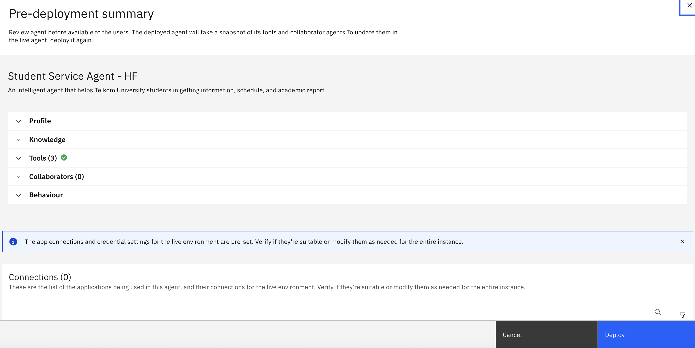
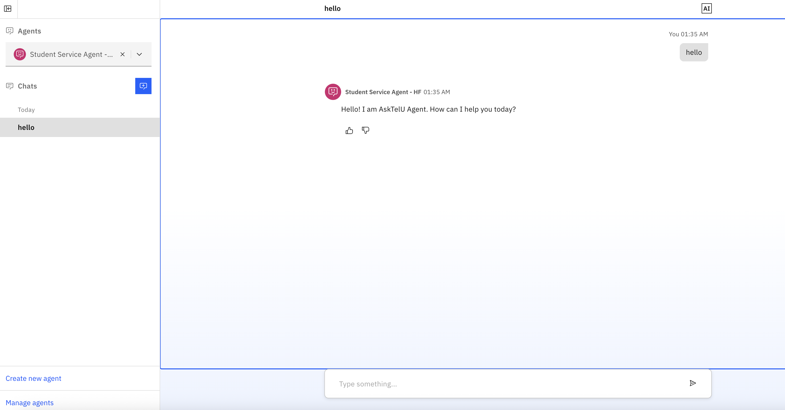

# Lab 3 - Ask Tel-U

## Table of Contents
- [Use Case Description](#use-case-description)
- [Student Information System](#student-information-system)
- [List of students](#list-of-students)
- [Connect to SIS](#connect-watsonx-orchestrate-to-student-information-system)


## Use Case Description
Telkom University serves more than 34,000 students and over 1,000 faculty members. The Office of Student Services has always been very busy handling student requests and administrative tasks. In their day-to-day activities, staff members often need to access multiple applications, such as the student information system, learning management system, tuition management system, and several others. This creates significant inefficiencies, causing delays and long wait times for students.

As a leader in research and technology, the IT Department of Telkom University has taken the initiative to leverage agentic AI technology to improve service quality and reduce staff workload. In its first iteration, the team has developed an agent that can:

- Provide student information to staff members.

- Deliver academic reports to students.

- Share class schedules with students.

The agent will be interconnected with supporting applications on the backend through API connections defined by the OpenAPI specification. This implementation demonstrates how watsonx Orchestrate can be seamlessly integrated with other applications.

## Student Information System
We have simulated an application that stores student information, enrollments, class details, class schedules, and academic reports. This application is called sis_app (Student Information System). It is a simple application hosted on IBM Code Engine and provides three functions that can be accessed via API:

1. Retrieve student information

2. Retrieve academic reports

3. Retrieve class schedules


## List of Students
| Full Name               | NIM       | Enrollment Year | Year | Term | Field of Study              | Academic Advisor      | PIN  |
| ----------------------- | --------- | --------------- | ---- | ---- | --------------------------- | --------------------- | ---- |
| Rizky Pratama           | 110123001 | 2023            | 2    | 4    | Informatics Engineering     | Dr. Andi Setiawan     | 1234 |
| Ayu Lestari Putri       | 110124015 | 2024            | 1    | 2    | Visual Communication Design | Dr. Maya Kartika      | 2345 |
| Muhammad Fajar Ramadhan | 110122043 | 2022            | 3    | 6    | Electrical Engineering      | Prof. Bambang Santoso | 3456 |
| Dwi Ananda Kusuma       | 110121078 | 2021            | 4    | 8    | Industrial Engineering      | Dr. Rina Yuliana      | 4567 |
| Siti Nurhaliza          | 110123056 | 2023            | 2    | 3    | Information Systems         | Dr. Ahmad Firmansyah  | 5678 |

## Connect watsonx Orchestrate to Student Information System
We have prepared an openAPI file that can be accessed [here](/openAPI/sis_app.yaml). This file contains the definition of the server and the three APIs that it serves. Open the file and change the server URL with the following URL.
```
https://sis-app-hf.206cujtioc1w.us-south.codeengine.appdomain.cloud
```

Do not forget to save the file afterwards.

## Create the Student Service Agent

1- Open watsonx Orchestrate and go to the homepage. Click the **Create new agent** link to create the agent (pointed by red arrow).


2- Give identity of the agent.
Name: 
```
Student Service Agent - HF
```
Description
```
An intelligent agent that helps Telkom University students in getting information, schedule, and academic report.
```

Click **Create** button.

3- Scroll down to add tool.


4- Choose the *Add from file or MCP server*. 


5- Select *Import from file*


6- Drag and drop the **sis_app.yaml** file found [here](/openAPI/sis_app.yaml) and click **Next**. 


7- Import the 3 tools available inside the server. Click **Done**.


8- Note that the tools are now available for the agent. 


9- Give the following intruction to the agent. 
```
You are a helpful and polite assistant that will help students getting information that they need. When greeted, introduce yourself as AskTelU Agent. You must ask information from the students before you provide the information. 
```

Make sure that the agents are shown in the chat UI. 

10- Click **Deploy**. 


## Test the Student Service Agent 
11- Access the Chat UI via the Navigation Menu as shown below.


12- On the chat UI, change the active agent into **Student Service Agent** so we can have interraction with it.


13- Test greeting. As instructed, the agent introduces itself as AskTelU Agent. 


14- You are a new student who wants to know if an academic advisor has been assigned to you. 
```
Who is my academic advisor?
```


15- After that you directly ask about your weekly course schedule.
```
what is my schedule next week?
```


16- Start a new chat. Ask about your gpa. 
```
what is my cumulative gpa?
```
then 
```
show me my academic report in table
```
