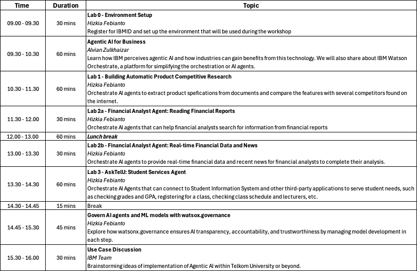

# Training for Trainers IBM x Telkom University
## Building Agentic AI Applications using IBM watsonx

## 📖 Overview

**IBM watsonx Orchestrate** empowers your business by automating tasks, simplifying complex processes, and ultimately saving you and your team time and effort. Get access to a broad range of prebuilt apps and skills to help you and your team complete daily tasks like emailing coworkers, collating spreadsheets, creating cases at Customer Relationship Management (CRM) platforms, and so much more.

**IBM watsonx AI** 
IBM watsonx.ai is IBM’s next-generation AI and machine learning platform that helps organizations build, train, and deploy AI models responsibly and at scale.

- It provides foundation models and generative AI capabilities that can be customized for business use cases (like customer service, automation, or document processing).

- It includes tools for traditional machine learning as well as large language models (LLMs), so teams can experiment with different AI techniques in one environment.

In short, watsonx.ai lets businesses leverage trusted, enterprise-ready AI without having to build everything from scratch.

## 🎯 Purpose

This workshop aims to introduce Agentic AI into organizational workflows using [watsonx Orchestrate](https://www.ibm.com/products/watsonx-orchestrate) and [watsonx.ai](https://www.ibm.com/products/watsonx-ai).

## 👉 Agenda

## 🚀 Goals
What we will learn: 
- How Agentic AI Applications impact business in modern days. 
- How to use Watson Orchestrate and Watson AI to build agentic AI applications that solve real world problems.
- How to provide knowledge to AI agents that are stored in a knowledge base or connect to the internet
- How to create tools and equip our AI agents with necessary tools to perform tasks
- How to govern AI and Machine Learning models for achieving trust and accountability.